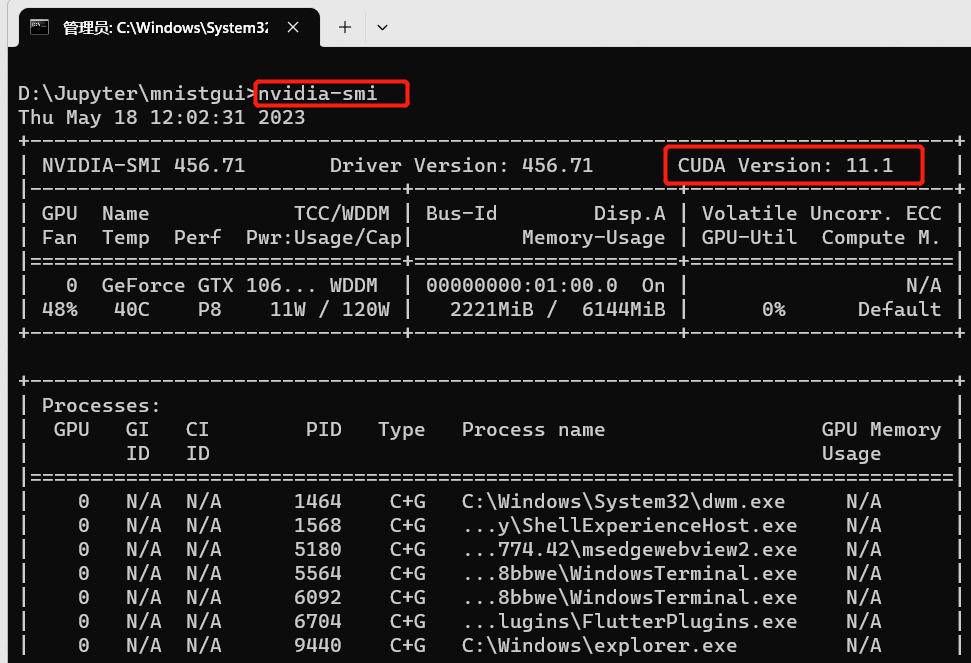

# mnistgui
卷积神经网络算法实现GUI手写数字识别mnist


# 模型训练
- 本模型采用GPU模式进行训练，需要提前确定自己电脑是否带有独立显卡


- 在models包下面的trainmodel.py文件执行train_data(100)方法,括号内是训练次数，可以自定义
输出结果如下

```shell
Test set: Avg. loss: 0.0285, Accuracy: 9911/10000 (99%)
```
# 图片保存

getimg是从mnist数据集提取数据，会自动根据日期存储到当前目录
saveimg是从手绘数据点击“保存”，会自动根据日期存储到当前目录

